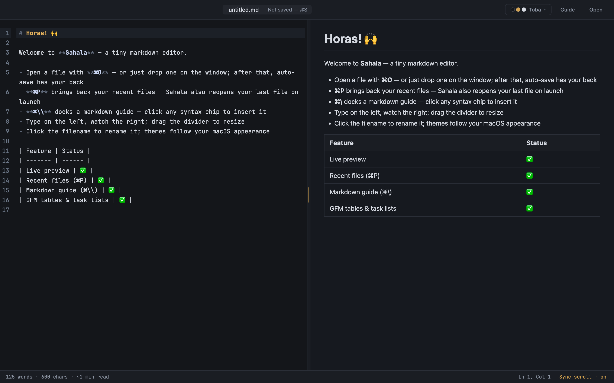
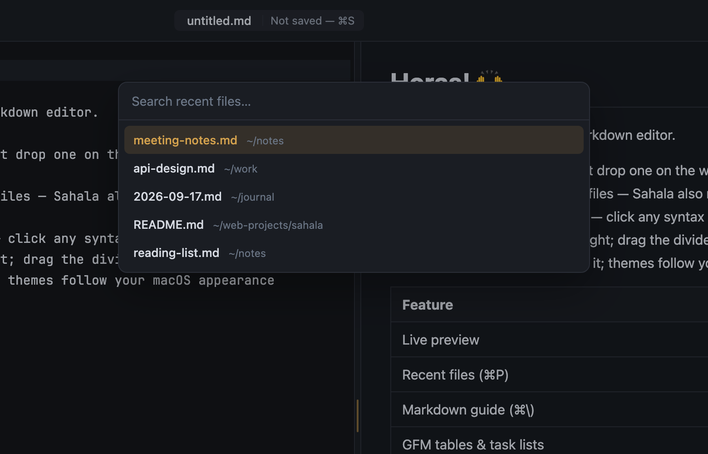
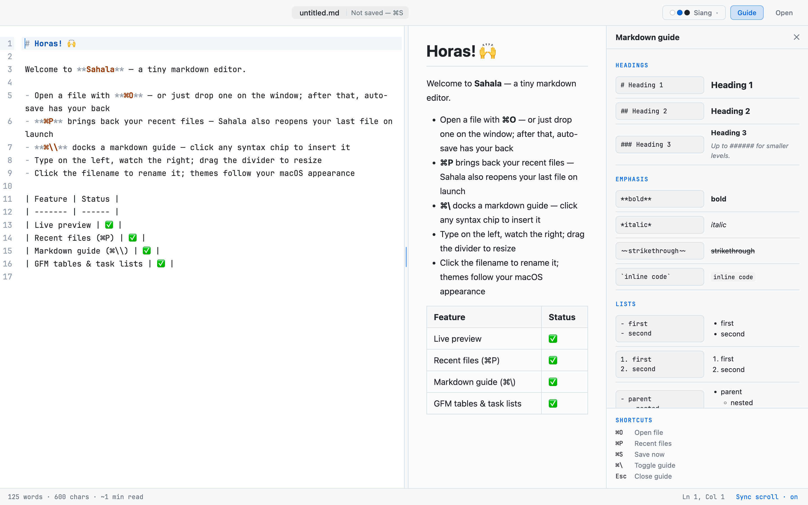
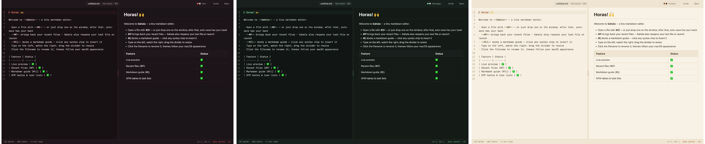
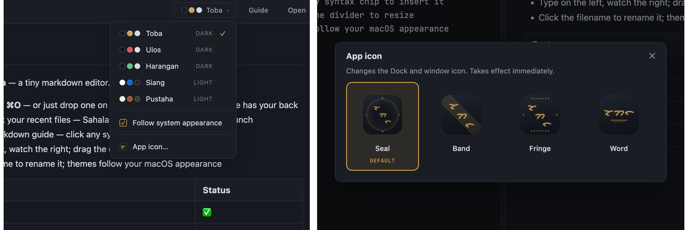

# Sahala ᯘ

> *Sahala* — in Batak belief, the spiritual power, charisma, and authority that
> radiates from a strong *tondi* (life-force). Your words carry weight.



## Why does this exist?

Because editing a markdown file had turned into a ceremony.

You want to fix three lines in a README. So you launch VS Code — splash
screen, window restore, extensions warming up, a language server politely
indexing a folder you never asked about. A gigabyte of tooling stretches
awake so you can type `## Notes`. Or you reach for one of the pretty
Electron editors, which solve the problem by shipping an entire Chromium
browser to render... text.

That's a lot of machinery standing between you and your words.

**Sahala is the counter-argument.** A markdown editor that opens like a
thought: instantly, quietly, already focused. No workspace, no plugins, no
update nag. Type on the left, watch it render on the right, close it, get
on with your life. It's built on Tauri — a thin Rust shell around the
WebView your OS already has — so the whole app weighs megabytes, not
browsers.

And because a tool for words should have a soul: it's named after the
Batak idea that language carries power, and its themes are drawn from home —
Lake Toba's gold on dark water, the red of a woven *ulos*, forest-green
*harangan*, bright *siang* daylight, and the sepia of an old *pustaha*
manuscript.

Small tool. Strong *tondi*.

## Features

### ✍️ Writing

- **Split view** — CodeMirror 6 editor on the left, live GFM preview
  (markdown-it) on the right, re-rendered as you type
- **Markdown syntax highlighting** in the editor — headings, emphasis,
  links, quotes, all colored by the active theme
- **GitHub-flavored markdown**: tables, task lists, strikethrough,
  auto-linked URLs
- **Fenced code blocks highlighted in both panes** (TypeScript, Rust, Go,
  Java, and the rest of highlight.js' common set)
- **Two-way scroll sync** — editor and preview follow each other
  proportionally; toggle it from the status bar when you want them apart
- **Live document stats**: word count, characters, estimated read time,
  and cursor `Ln, Col`

### 📁 Files that take care of themselves

- **Auto-save** writes one second after you stop typing — the filename
  pill shows the truth at all times: `Edited` → `Saving…` → `Saved · 14:02`
- **`⌘S` is a manual flush**, not a chore (untitled files need one `⌘S`
  to pick a path via the native save dialog)
- **Click the filename to rename** — commits the rename to disk in place,
  no Finder round-trip
- **`⌘O`** opens via the native dialog; the window title follows the file
- **`⌘P` quick switcher** — fuzzy-search your recent files and jump between
  them without ever seeing a dialog
- **Session restore** — launching Sahala reopens the file you were last
  working on
- **Finder is a first-class door**: Sahala registers as a markdown editor
  (right-click → *Open With*), and you can drop a `.md` file anywhere on
  the window to open it



### 📖 Built-in markdown guide



- **`⌘\` docks a syntax cheatsheet** as a third column — editor and
  preview politely compress, nothing gets covered
- Every entry shows the raw syntax next to its **live-rendered result**,
  produced by the same renderer as the preview — what you see is exactly
  what Sahala will do
- **Click any syntax chip to insert it at the cursor** — or select text
  first and it wraps the selection (`**bold**`, `*italic*`, links…)
- A shortcuts reference sits in the panel footer; `Esc` closes it

### 🎨 Five themes, one identity



- Dark: **Toba** (gold on dark water) · **Ulos** (weaving red) ·
  **Harangan** (forest green)
- Light: **Siang** (clean daylight) · **Pustaha** (manuscript sepia)
- A swatch-preview menu shows each theme's colors before you commit
- **Follows macOS light/dark appearance** — Sahala remembers a favorite
  theme for each mode and switches with the system (or turn that off and
  pin one)
- Theming runs on CSS design tokens end to end: chrome, editor syntax
  colors, preview typography, code highlighting — no unthemed corners

### ᯘᯂᯞ A real Surat Batak icon — your choice of four


- The icon spells the actual word **sa-ha-la** (ᯘ ᯂ ᯞ) in Surat Batak
  script — not a decorative squiggle
- **Seal** (default): the word engraved inside a double ring over a woven
  *ulos* lattice, with compass diamonds — a magic-seal feel fitting a word
  for spiritual authority
- Three alternates — **Band**, **Fringe**, **Word** — selectable in-app
  (theme menu → *App icon…*); the Dock icon switches instantly and the
  choice persists across restarts



### 🪟 Chrome that stays out of the way

- **Single-row window chrome** — traffic lights sit inline with the
  toolbar; no wasted title bar
- Ghost buttons, a filename pill, and a quiet one-line status bar: the
  content owns the window
- **Resizable split** — drag the divider; double-click it to reset 50/50;
  position remembered

### ⌨️ Shortcuts

| Key | Action |
| --- | ------ |
| `⌘O` | Open file |
| `⌘P` | Recent files (quick switcher) |
| `⌘S` | Save now / save as |
| `⌘\` | Toggle markdown guide |
| `Esc` | Close guide / menus |

## Development

```bash
npm install
make dev        # run with hot reload
make check      # typecheck frontend (tsc) + backend (cargo check)
```

## Build & install

```bash
make ship       # build → install to /Applications → launch
```

Or step by step: `make build` (produces `Sahala.app` + a `.dmg` under
`src-tauri/target/release/bundle/`), `make install`, `make run`.
Regenerate the full icon set from the SVG sources with `make icons`.

## Stack

- [Tauri 2](https://tauri.app) — Rust shell + system WebView (no Electron)
- Vanilla TypeScript + Vite — no framework
- [CodeMirror 6](https://codemirror.net) — editor pane
- [markdown-it](https://github.com/markdown-it/markdown-it) — preview rendering
